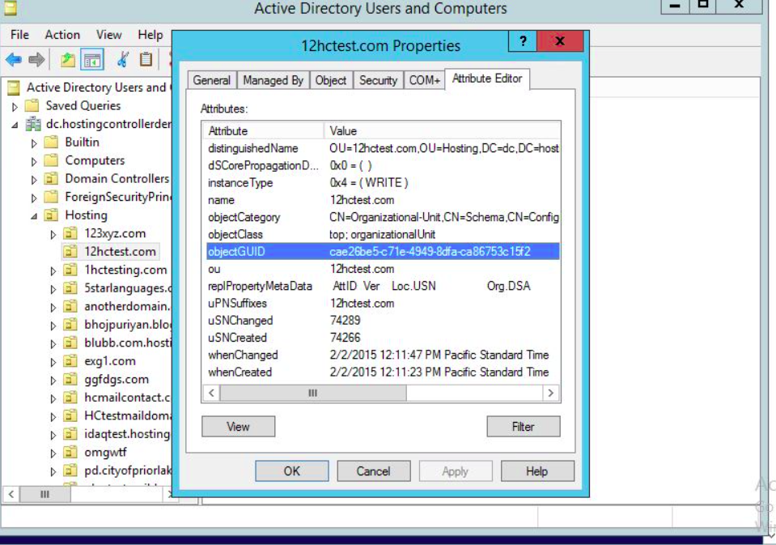

# BAT - Bastogne Automation Tool


<br>

# Description
BAT is a PowerShell module used for streamlining helpdesk operations for an Army network. This tool helps automate the process of checking user's compliance in ATCTS alongside account creation/modification in Active Directory.

# Features
<ul>
  <li> Check ATCTS compliance </li>
  <li> Check if user has an AD account (including visitors accounts) </li>
  <li> Enable users in AD </li>
  <li> Create users </li>
  <li> Log output for later reference </li>
</ul>

# A Note on Classification
This codebase for the BAT module itself is unclassified. It is written in a way that deliberately contains no Personally Identifiable Information (PII) or Controlled Unclassified Information (CUI). As it exists in this repository, BAT is unusable (as it is dependent on the configuration of the <em>OrganizationalUnits.csv</em> file and the presence of an ATCTS report).

Once installed and configured, the classification would raise to CUI -- thus requiring compliance with all CUI data protection measures. 

# Requirements
### BAT has the following dependencies:
<ul>
  <li> PowerShell version 5.1 or higher </li>
  <li> Active Directory (RSAT) </li>
  <li> An ATCTS report in CSV format with the following headers: </li>
    <ol>
      <li> EDIPI </li>
      <li> Personnel Type </li>
      <li> HQ Alignment Subunit </li>
      <li> Name </li>
      <li> Rank/Grade </li>
      <li> Profile Verified </li>
      <li> Date SAAR/DD2875 Signed </li>
      <li> Date Awareness Training Completed </li>
      <li> Date Most Recent Army IT UA Doc Signed </li>
      <li> Enterprise Email Address </li>
    </ol>
  <li><strong>Must be run with administrative privileges to create/enable users</strong></li>
</ul>

# Installation
<ol>
  <li> Click the 'code' dropdown menu and download the .zip file. </li>
  <li> Extract the contents and find the BAT folder. </li>
  <li> The BAT folder should have the following contents/structure: </li> <br>
  <ul> 

```
BAT/
|_ BAT-Library/
| |_ BAT-Library.psm1
| |_ OrganizationalUnits.csv
| |_ Set-OrganizationalUnits.ps1
|_ BAT.psd1
|_ BAT.psm1
```

  </ul>
  <li> Copy the BAT folder and all of its contents to <code>C:\Program Files\WindowsPowerShell\Modules</code> </li>
  <li> Open a PowerShell window and run: <code>Import-Module BAT</code> </li>
  <li> For usage instructions run: <code>Get-Help BAT</code> </li>
</ol>

# Configuration - (Manual)
Before using the `-Create` feature, you must configure your <strong>OrganizationalUnits.csv</strong> file. This file can be found in the <strong>BAT-Library</strong> subfolder. This file simply contains the Distinguished Names (DNs) of the Organizational Unit (OU) containers that house your users. Leave the <em>Name</em> field as default for 'Visitor' and 'HHC BDE', however you must change the <em>Name</em> field for each of your subunits.

<strong>How do I find my DNs?</strong>
<br>
You can find your OU DNs by opening <strong>Active Directory Users and Computers (ADUC)</strong>, right clicking on the OU where your users are, and selecting <em>properties</em>. Then click on <em>Attribute Editor</em> and find the <em>Distinguished Name</em> field.




# Configuration - (Scripted)
Alternatively, you can run the interactive configuration script <strong>Set-OrganizationalUnits.ps1</strong> also located in the <strong>BAT-Library</strong> subfolder. This script will need to be run with administrative privileges, as it must make changes in the `C:\Program Files` directory.

# Usage
<ul>
  <li> Basic syntax: </li> 
  
`bat [EDIPIs] [Options]`

  <li> Options: </li>
  
  <ul>
    <li> <strong>CheckATCTS:</strong> This will check the user(s) ATCTS report and provide feedback on delinquent items. </li>
    <li> <strong>CheckAD:</strong> This will report whether or not the user is found in Active Directory. It will also identify if the user has a DoD visitor account on Ft. Campbell. </li>
    <li> <strong>Create:</strong> This will create the user, formatting all fields based on information from the ATCTS report and placing in the correct OU based on the <em>OrganizationalUnits.csv</em> file. User will only be created if ATCTS report is clean. <strong>User will be created in a disabled state -- it is suggested to follow up with the</strong> <code>-Enable</code> <strong>option.</strong> <em>(requires admin credentials)</em>
    <li> <strong>Enable:</strong> This will enable the user, only if their ATCTS report is clean. <em>(requires admin credentials)</em></li>
    <li> <strong>Log:</strong> This will log the output to a .txt file in the working directory. </li>
    <li> <strong>Path:</strong> This will specify the path to your ATCTS report (.csv file) -- default value is <strong>.\report_export</strong> if not specified</li>
  </ul> <br>

  <li> Simple Examples: </li>

`bat 1234567890 -CheckATCTS` -- This will check a single user's ATCTS report <br>
`bat 1234567890 -CheckAD` -- This will check if the user exists in Active Directory <br>
`bat 1234567890 -Enable` -- This will enable the user, but only if their ATCTS report is clean <br>
`bat 1234567890 -Create` -- This will create the user in the appropriate OU, but only if their ATCTS report is clean
  
  <li> Dynamic Examples: </li>

`bat 1234567890,3216549870,4560123987 -CheckATCTS` -- Check multiple user's ATCTS <br>
`bat 1234567890,3216549870,4560123987 -CheckATCTS -CheckAD` -- Check multiple user's ATCTS reports and check for accounts in Active Directory <br>
`bat 1234567890,3216549870,4567893210 -Create -Enable` -- Create multiple users and enable them after creating.<br>
`bat 1234567890,3216549870,4560123987 -CheckATCTS -Log` -- Check multiple user's ATCTS and log the output <br>

</ul>

